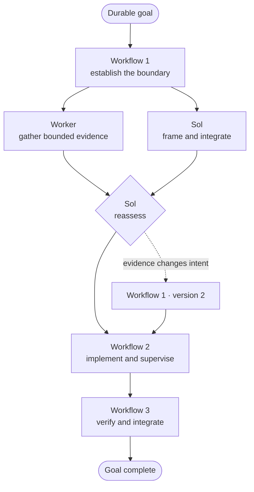

<p align="center">
  
</p>

# Sol Orchestrator

**A graph-native multi-agent harness for OpenCode.**

Sol Orchestrator turns one user goal into a sequence of binding workflow graphs.
Sol keeps the whole goal in view and makes the decisions. Workers take on
focused jobs inside the graph, then bring back evidence for Sol to review.

The result is more useful than a swarm and cheaper than asking the most capable
model to do every local task itself. Sol can keep the important decisions in
context, use smaller profiles where they are enough, and stay responsible until
the user's real outcome is complete.

## Highlights

- **One goal, many workflow graphs.** Sol stays responsible across workflows
  and graph revisions. Finishing one graph does not quietly end the goal.
- **Graphs that run the work.** Step and job DAGs control what is ready, what is
  blocked, what can run in parallel, and what still needs review. They are not
  diagrams pasted on top of an agent loop.
- **Workers do the local work.** They receive one bounded job at a time. Sol
  keeps architecture, priorities, integration, and the final call.
- **Supervision starts early.** Sol can inspect an emerging diff, read a
  completed tool result, correct drift, or wait for a meaningful event.
- **The important context stays clean.** Worker transcripts do not spill into
  Sol's conversation. Sol pulls only the result, diff, or tool output it needs.
- **Bring your own profiles.** OpenCode owns every profile's model and reasoning
  settings. The plugin discovers configured subagents—including custom ones—and
  never hardcodes provider model IDs.
- **The workflow guides without trapping Sol.** Real work follows the current
  graph, but Sol can still think, inspect, supervise, and replace a plan that
  new evidence has made wrong.
- **Shared work stays safer.** Optional write scopes, permission decisions,
  change tracking, and guarded undo/redo help workers avoid stepping on each
  other.

## From one goal to many workflow graphs

The durable shape looks like this:

```text
Goal: ship the complete feature
│
├── Workflow 1: understand the real boundary
│   ├── Graph v1
│   │   ├── Step: frame the problem
│   │   │   └── Job: Sol defines the questions
│   │   └── Step: gather evidence
│   │       ├── Job: worker inspects the runtime
│   │       └── Job: worker maps affected callers
│   └── Graph v2              replaces unfinished v1 after new evidence
│       └── ...
│
├── Workflow 2: implement the chosen design
│   └── ...
│
└── Workflow 3: verify, integrate, and close the goal
    └── ...
```

A goal is the outcome the user cares about. A workflow is one chapter in
reaching it. Each workflow has a versioned graph. Steps explain the larger
order; jobs say who does each piece.

Inside a step, jobs form a smaller semantic DAG of their own:

```text
inspect runtime ─┐
                 ├──> Sol reassesses ──> implement ──> verify
map callers ─────┘
```

That shape is what lets independent work run together without losing the
reason it was assigned. A plain loop remembers only “what next?” The workflow
graph remembers what depends on what, who owns each obligation, and which
evidence changed the plan.

When a worker finishes, its job moves to review—not straight to done. Sol can
inspect the evidence, ask for a correction, or change the unfinished plan. When
a workflow closes, Sol looks back at the goal and decides what the next chapter
needs to be.



The workflow keeps the current work honest. The goal keeps Sol responsible.
That is why a plan can change without becoming optional, and why finishing a
plan does not mean the whole task is finished.

## How it works

Start OpenCode with Sol, then give it a durable objective:

```sh
opencode --agent sol
```

```text
/goal Replace the parser without changing emitted records. Establish the
current behavior, implement the smallest safe change, and verify the real
boundary.
```

The plugin persists the goal before Sol's first turn. Sol authors the first
useful graph, launches ready jobs, and stays responsible while they run. It may
inspect an emerging diff, steer a worker before the mistake spreads, work on an
independent integration question, or deliberately wait for a meaningful event.
When one workflow closes, Sol reassesses the *goal* instead of pretending the
whole task is over.

If progress genuinely needs you or some external state, Sol can block the goal
and finish its explanation normally. When the boundary is resolved, it resumes.
If you want to discard the orchestration entirely, `/goal-stop` stops associated
workers and clears the goal plus all of its workflow state. It never silently
reverts repository or Git changes.

## Who does what

| Agent | Best used for |
| --- | --- |
| **Sol** | Owning the goal, shaping the workflow, steering workers, reconciling evidence, and making the final call. |
| **Luna Medium** | Clear, narrow work with an obvious method and an easily checked result. |
| **Luna Max** | Careful investigation, adversarial checking, and precise verification. |
| **Terra Medium** | Cross-file work inside one known subsystem where stronger interpretation is useful. |
| **Terra Max** | Difficult bounded work with genuine ambiguity or regression risk inside Sol's decided design. |

These are useful defaults, not a closed list. You can replace them or add your
own OpenCode subagent profiles. Each profile carries its own model, reasoning
settings, and routing description; the plugin only sees the profile as one
configured choice.

## Control without micromanagement

### Steer work already in motion

Sol can send a correction while a worker is thinking or using a tool. Active
tools are allowed to finish safely before the old turn is superseded. If
several corrections arrive before dispatch, they travel together in order, so
the worker receives the whole updated direction instead of one message being
rejected or lost.

### Pull evidence, not entire transcripts

Worker sessions can be long. Sol sees compact progress and availability first,
then pulls exactly what matters: one result, one file diff, or one tool output.
The parent context stays useful instead of filling with every worker token.

### Review before completion

A worker's final answer moves its job to **review**, not **done**. Sol can
inspect the result, retry the same job, or replace unfinished parts of the
workflow. Completion remains a judgment, not a notification.

### Change the plan when reality changes

The workflow is versioned, but ordinary progress is not. New evidence can
replace unfinished topology without rewriting completed work or maintaining a
forest of speculative failure branches.

### Wait without giving up

An active goal always leaves Sol with the next decision. That does **not** mean
busywork, constant polling, or generic “continue” messages. Sol keeps working
while useful owner work remains. When the next decision really depends on a
worker, it waits for a bounded event and reassesses. If Sol tries to finish a
normal turn while the goal is still active, OpenCode continues it once through
the native session system.

## Safety without a cage

Workers may read the repository normally. Write scope is optional and applies
only to writes:

| `writeFiles` | Meaning |
| --- | --- |
| Omitted | No plugin-level write restriction. |
| `[]` | No structured file write is pre-authorized. |
| Globs supplied | Matching structured writes proceed; relevant out-of-scope writes pause for Sol. |

Shell commands remain useful for builds, tests, and inspection. For scoped
jobs, their Git-visible changes are audited after the command because arbitrary
shell mutation cannot honestly be prevented in advance.

When a worker turn is isolated, Sol may also request guarded undo and redo.
Those controls refuse to run if provenance, file hashes, overlapping work, or
the current OpenCode state no longer make the operation safe.

## A TUI for humans

The companion TUI keeps OpenCode's native session navigation and adds two views:

- **Subagents** — a stable parent-side list of managed workers.
- **Goal & Workflow** — the durable goal, current graph version, steps, jobs, actors, live state, progress,
  blockers, changed files, review state, undo availability, and actions that
  are possible now.

Internal correlation IDs stay internal. The normal interface speaks in the
names you authored.

## Install

Install the server and TUI directly from GitHub:

```sh
opencode plugin github:ReyJ94/Sol-Orchestrator
```

Restart OpenCode, then begin with:

```sh
opencode --agent sol
```

OpenCode loads plugin code and agent prompts at startup, so reinstalling or
changing plugin configuration also requires a restart.

<details>
<summary><strong>Manual configuration</strong></summary>

The installer detects both package entrypoints and updates the appropriate
configuration files automatically. For a manual setup, load the server export
from `opencode.json`:

```json
{
  "plugin": ["opencode-sol-orchestrator/server"]
}
```

Load the TUI export from `tui.json`:

```json
{
  "plugin": ["opencode-sol-orchestrator/tui"]
}
```

If `opencode-compaction` is also installed, list the orchestrator server first
so its compact workflow snapshot is available to the compaction plugin.

</details>

## Sol does not have to guess

The harness gives Sol an `available_actions` list containing everything it can
actually do right now. Known values are already filled in. Missing decisions
are named in plain language. Internal workflow, worker, prompt, permission, and
evidence IDs stay inside the plugin.

That means Sol can choose what should happen next without first reverse
engineering how to call it. For example:

```json
{
  "args": {},
  "needs": ["objective", "steps"],
  "tool": "workflow_start"
}
```

<details>
<summary><strong>Workflow and worker control reference</strong></summary>

### Goal controls

| Control | Purpose |
| --- | --- |
| `/goal <objective>` | Explicitly start and persist a durable user goal. |
| `goal_complete` | End liveness only after the real outcome is achieved. |
| `goal_block` | Suspend liveness at a genuine user or external boundary. |
| `goal_resume` | Resume after that boundary is resolved. |
| `/goal-stop` | User-only reset: stop managed workers and clear every workflow belonging to the goal. |

### Workflow controls

| Control | Purpose |
| --- | --- |
| `workflow_status` | Read the current semantic workflow and every action available now. |
| `workflow_start` | Start one complete workflow at version 1. |
| `workflow_delegate` | Atomically create, scope, bind, and start one ready semantic worker job. |
| `workflow_complete` | Complete Sol's own job or accept a reviewed worker result. |
| `workflow_retry` | Reopen one unchanged reviewed or blocked job. |
| `workflow_replace` | Replace unfinished workflow intent with a new version. |

### Worker controls

| Control | Purpose |
| --- | --- |
| `agents_status` | Read compact worker state and its currently available controls. |
| `agents_inspect` | Materialize one selected result, diff, or tool output and return its private local file metadata. |
| `agents_send` | Send immediate or safely preemptive steering. |
| `agents_wait` | Wait for a meaningful event from one or more workers. |
| `agents_interrupt` | Permanently stop a worker and block its job. |
| `agents_permission` | Decide one suspended structured write outside the authored scope. |
| `agents_undo` | Revert an isolated worker turn after all safety guards pass. |
| `agents_redo` | Restore that turn while the independently guarded redo window remains valid. |
| `report_to_parent` | Let a worker report meaningful progress or a terminal blocker. |

Status, waiting, background completion, and compaction never dump full worker
results or transcripts. `agents_inspect` returns a directory and filename for
one selected artifact; Sol searches or reads it with ordinary terminal tools,
so the harness never floods the model-facing context with the body.

</details>

<details>
<summary><strong>Persistence and compaction</strong></summary>

Durable orchestration state lives in `state-v2.json`. The old `state.json` is
left untouched and is not migrated.

State path precedence:

1. plugin option `statePath`;
2. `OPENCODE_SOL_ORCHESTRATOR_STATE_PATH`;
3. `$XDG_STATE_HOME/opencode/opencode-sol-orchestrator/state-v2.json`;
4. `~/.local/state/opencode/opencode-sol-orchestrator/state-v2.json`.

Parent compaction receives a bounded workflow snapshot: semantic state,
possibly truncated available actions, worker metadata, availability, and
per-turn change summaries. It does not copy child transcripts or synthesize a
new compaction prompt.

</details>

<details>
<summary><strong>Agent defaults and overrides</strong></summary>

The server can register model-less defaults for `sol`, `luna-medium`,
`luna-max`, `terra-medium`, and `terra-max`. OpenCode owns each profile's model
and reasoning settings as one choice. The plugin never hardcodes provider model
IDs or variants.

The harness discovers every enabled OpenCode agent whose mode is `subagent` or
`all`. Sol sees each profile's name and routing description in
`workflow_status.available_workers`. Custom names work normally. If a workflow
asks for a profile that is not configured, the plugin rejects it before changing
workflow state.

Custom workers receive the same managed-worker authority boundary as the
defaults, so adding a profile does not make it another orchestrator. All workers
share one operational prompt; profiles differ through your routing descriptions
and model choices, not duplicated behavior instructions.

Set the server plugin option `registerAgents` to `false` if you want to register
all agent definitions yourself.

</details>

## Development

The project uses Bun and TypeScript:

```sh
bun install
bun run check
bun run build:local
bun pm pack --dry-run
```

Supported OpenCode version: **1.18.1 or newer**.

## License

[MIT](LICENSE) · [Repository](https://github.com/ReyJ94/Sol-Orchestrator)
