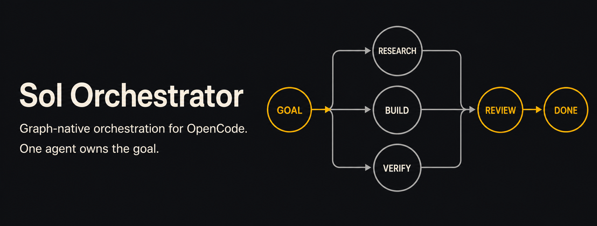

<p align="center">
  
</p>

<p align="center">
  <a href="https://github.com/ReyJ94/Sol-Orchestrator/releases/latest"></a>
  
  
  <a href="LICENSE"></a>
</p>

<p align="center">
  <strong>Graph-native multi-agent orchestration for OpenCode.</strong><br />
  One lead agent owns the goal, delegates bounded work, supervises execution,
  and remains responsible for the outcome.
</p>

Sol Orchestrator turns complex coding work into a managed execution system
without making you manage a swarm. Sol keeps the objective, architecture,
tradeoffs, and final judgment. Workers extend its reach where parallel or
specialized effort is useful. Their work returns for review—it does not silently
become truth.

The graph is the execution contract: it makes ownership, dependencies,
parallelism, review, and the legal next action explicit.

## Install

Requires [OpenCode](https://opencode.ai) 1.18.1 or newer.

```sh
opencode plugin -g github:ReyJ94/Sol-Orchestrator
opencode --agent sol
```

The installer configures both the orchestration server and the TUI globally.
Restart OpenCode after installing or updating the plugin.

<details>
<summary><strong>Update an existing installation</strong></summary>

```sh
opencode plugin -g --force github:ReyJ94/Sol-Orchestrator
```

</details>

## Give Sol the outcome

Use OpenCode normally. Describe the result you need rather than decomposing the
work yourself:

```text
Replace the parser without changing emitted records. Establish the current
behavior, implement the smallest safe change, and verify the real boundary.
```

Sol decides whether the work needs a workflow, which parts it should execute
itself, and which bounded jobs are worth delegating. The harness launches ready
workers, preserves causal order, exposes emerging evidence, and keeps Sol
responsible across corrections and follow-up workflows.

You do not assign worker IDs, reconstruct orchestration state, shuttle
transcripts between agents, or accept a worker's claim that the whole task is
done.

## The problem it solves

Most multi-agent systems optimize for fan-out: split the task, launch workers,
collect answers. That is easy. The hard part is preserving responsibility.

Complex repository work fails when:

- the plan stops adapting after workers discover new facts;
- local tasks finish while the user's actual goal remains incomplete;
- worker transcripts consume the lead agent's decision-making context;
- parallel changes are accepted without owner-level review;
- nobody knows whether to steer, retry, replace, wait, or stop.

Sol Orchestrator gives that responsibility one durable home.

| Without durable orchestration | With Sol Orchestrator |
| --- | --- |
| A flat checklist stands in for the outcome | The user's goal persists across multiple workflows |
| Every task is pushed to a worker | Sol delegates only bounded work that earns delegation |
| Worker completion is treated as success | Results enter explicit review before acceptance |
| Parallelism obscures causal order | A dependency graph exposes what can happen next |
| New evidence makes the plan stale | Unfinished work can be replaced by a new graph version |
| Full transcripts flood the lead context | Compact state points to selected evidence on demand |

## What Sol owns

- **The goal** — the complete result the user asked for, not merely the current
  batch of jobs.
- **The workflow** — a coherent execution episode with explicit steps,
  dependencies, actors, and acceptance conditions.
- **The decisions** — architecture, integration, tradeoffs, replanning, and the
  final call.
- **The supervision** — monitor work in progress, inspect emerging changes,
  steer early, retry narrowly, or replace obsolete work.
- **The proof** — worker output is evidence; Sol decides whether the owner-level
  outcome is actually complete.

Sol may perform an entire workflow itself. Delegation is optional and focused,
not the definition of progress.

## What the harness owns

The plugin keeps orchestration mechanics out of the model's working memory:

- creates and persists the durable goal;
- validates versioned workflow DAGs;
- launches ready workers automatically;
- enforces dependencies and one actor per job;
- tracks progress, review, blockers, and legal next actions;
- keeps worker sessions isolated from Sol's conversation;
- materializes only the selected result, diff, or tool output Sol requests;
- preserves goal and workflow state through long sessions and compaction.

The result is not autonomous chaos. It is explicit execution with one decision
owner.

## See the work, not the protocol

The included TUI preserves OpenCode's normal navigation and adds two focused
surfaces:

- **Subagents** — workers managed by Sol, their state, and relevant controls.
- **Goal & Workflow** — the durable objective, graph version, steps, jobs,
  actors, review state, blockers, changed files, progress, and available
  actions available now.

Internal correlation IDs stay out of the way. The interface uses the semantic
names Sol authored for the work.

## Context remains decision-shaped

Long worker sessions do not spill into Sol's conversation. Sol first receives
compact status and artifact metadata. When evidence can change a decision, it
selects one result, diff, or tool output and receives a private local path for
targeted inspection with ordinary tools such as `rg`, `jq`, or file globs.

This protects the context of the lead agent without hiding the evidence needed
for review.

<details>
<summary><strong>How goals, workflows, steps, and jobs fit together</strong></summary>

### One goal, many workflows

A **goal** is the outcome the user cares about. It may require several
workflows. Each workflow is one coherent execution episode with a versioned
graph. **Steps** are semantic stages or decision gates; **jobs** are concrete
obligations inside a step. Every job has exactly one actor: Sol or one worker
profile.

```text
Goal: ship the complete feature
│
├── Workflow 1: understand the real boundary
│   └── Graph v1
│       ├── worker: inspect runtime ─┐
│       ├── worker: map callers ─────┼──> Sol: synthesize evidence
│       └── Sol: choose the design ──┘
│
├── Workflow 2: implement the chosen design
│   ├── Sol or worker: bounded implementation
│   └── Sol: integrate and review
│
└── Workflow 3: verify the owner-level outcome
    └── Sol: complete the goal only when the result is proven
```

Dependencies express causal order while genuinely independent jobs remain
parallel. If evidence invalidates unfinished work, Sol replaces the graph
instead of forcing the original plan through reality.

Finishing one workflow does not finish the goal. Sol returns to the durable
objective and decides what the next chapter requires.

</details>

<details>
<summary><strong>Agent profiles and model routing</strong></summary>

| Bundled profile | Best used for |
| --- | --- |
| **Sol** | Goal ownership, workflow design, decisions, supervision, integration, and final judgment |
| **Luna Medium** | Clear, narrow work with an obvious method and an easily checked result |
| **Terra Medium** | Cross-file work in one known subsystem requiring stronger interpretation |
| **Terra Max** | Difficult bounded work with meaningful ambiguity or regression risk |

These are profile shapes, not hardcoded provider models. Configure their models
and reasoning settings in OpenCode, replace them, or add your own profiles.
Sol Orchestrator discovers the profiles you expose.

</details>

<details>
<summary><strong>Customize the bundled agents</strong></summary>

With the default `registerAgents: true`, configuration for the bundled `sol`
and worker profile names can customize their model, variant, description,
prompt/persona, and ordinary tool capabilities.

Sol Orchestrator appends its versioned harness contract after a custom prompt
and keeps its required mode, limits, and orchestration permissions
authoritative. Set `registerAgents: false` to opt out of bundled registration
and provide fully custom agents.

Keep custom prompts focused on persona, judgment, or domain worldview rather
than copying the plugin's orchestration protocol.

The bundled Sol prompt uses `development-loop` as one example of a skill that
can shape evidence, ownership, implementation order, and acceptance. That skill
is not included with this plugin; replace the reference with your own
development discipline when needed.

</details>

<details>
<summary><strong>Command reference</strong></summary>

Most users only need:

```sh
opencode --agent sol
```

### Goal controls

| Command or action | Purpose |
| --- | --- |
| `/goal` | Show the durable goal and current workflow |
| `/goal <objective>` | Explicitly create a goal or promote an unassociated workflow |
| `/goal-stop` | Stop the goal and its workers without reverting repository changes |
| `goal_complete` | Close the goal after the complete outcome is proven |
| `goal_block` | Pause at a genuine user or external boundary |
| `goal_resume` | Continue after the blocker is resolved |

### Workflow controls

| Action | Purpose |
| --- | --- |
| `workflow_status` | Read the graph and legal next actions |
| `workflow_start` | Start a complete workflow and automatically launch ready workers |
| `workflow_complete` | Complete Sol's job or accept a reviewed worker result |
| `workflow_retry` | Reopen one reviewed or blocked job without redesigning it |
| `workflow_replace` | Replace unfinished work with a new graph version |

### Worker controls

| Action | Purpose |
| --- | --- |
| `agents_status` | Read compact worker state and available controls |
| `agents_inspect` | Materialize one selected result, diff, or tool output |
| `agents_send` | Steer work already in progress |
| `agents_wait` | Wait for a meaningful event |
| `agents_interrupt` | Stop obsolete work without losing a just-completed result |
| `agents_permission` | Decide a suspended write outside an authored scope |
| `agents_undo` | Revert an isolated worker turn when safety checks pass |
| `agents_redo` | Restore that turn while its guarded redo window remains valid |

</details>

## Companion plugins

Sol Orchestrator is complete on its own. These optional plugins extend the
workspace around it:

- **[OpenCode Compaction](https://github.com/ReyJ94/Opencode-Operational-Checkpoint)**
  <br />
  Preserves an operational checkpoint through context compaction, including the
  bounded Sol workflow state.
- **[OpenCode Skill Picker](https://github.com/ReyJ94/Opencode-Skill-Picker)**
  <br />
  Selects which development and domain skills are available without loading
  every skill into every session.

<details>
<summary><strong>Install companion plugins</strong></summary>

```sh
opencode plugin -g github:ReyJ94/Opencode-Operational-Checkpoint
opencode plugin -g github:ReyJ94/Opencode-Skill-Picker
```

</details>

## Development

<details>
<summary><strong>Build and verify from source</strong></summary>

```sh
git clone https://github.com/ReyJ94/Sol-Orchestrator.git
cd Sol-Orchestrator
bun install --frozen-lockfile
bun run check
bun run build:local
bun pm pack --dry-run
```

</details>

## License

[MIT](LICENSE) © 2026 ReyJ94
